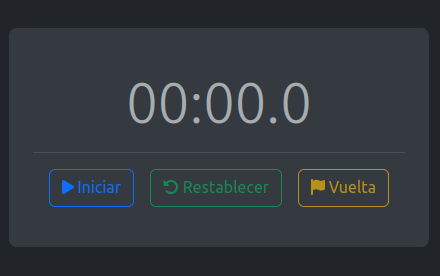
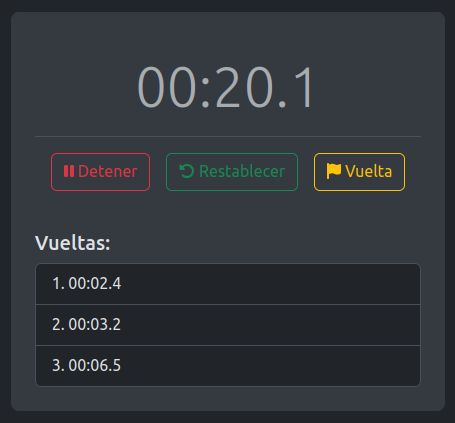

# CRONOMETRO EN REACT

Este proyecto esta enfocado a la practica de React, mediante la realización de un cronómetro interactivo, que incluye funcionalidades para iniciar, detener, reiniciar y registrar vueltas. Utiliza componentes reutilizables y estilización con Bootstrap y FontAwesome para lograr un diseño limpio y funcional.

## Dependencias Utilizadas

- **[@fortawesome/free-solid-svg-icons](https://www.npmjs.com/package/@fortawesome/free-solid-svg-icons):** Proporciona iconos de FontAwesome para la interfaz de usuario.
- **[bootstrap](https://www.npmjs.com/package/bootstrap):** Framework CSS para estilizar la aplicación.
- **[react-bootstrap](https://www.npmjs.com/package/react-bootstrap):** Implementa los componentes de Bootstrap en React.

## Integrantes del grupo

-   Cristian Monteros;

-   Juan Cruz Galvez;

-   Mauro Fregenal;

-   Emir Paradi.

## Link del DEMO

